# 🍋 Lemonade Stand Game - Complete Overview

## 📖 Introduction

Lemonade Stand is a business simulation game where you start with $50 and build a lemonade empire over a 90-day season. Make strategic decisions about recipes, pricing, inventory, and upgrades to maximize profits while adapting to weather, events, and customer demand.

## 🎯 Game Objectives

- **Primary Goal**: Maximize profit over a 90-day season
- **Strategic Elements**: Recipe quality, pricing strategy, inventory management, location selection
- **Long-term Planning**: Unlock upgrades, manage savings, optimize operations

## 🎮 Game Flow

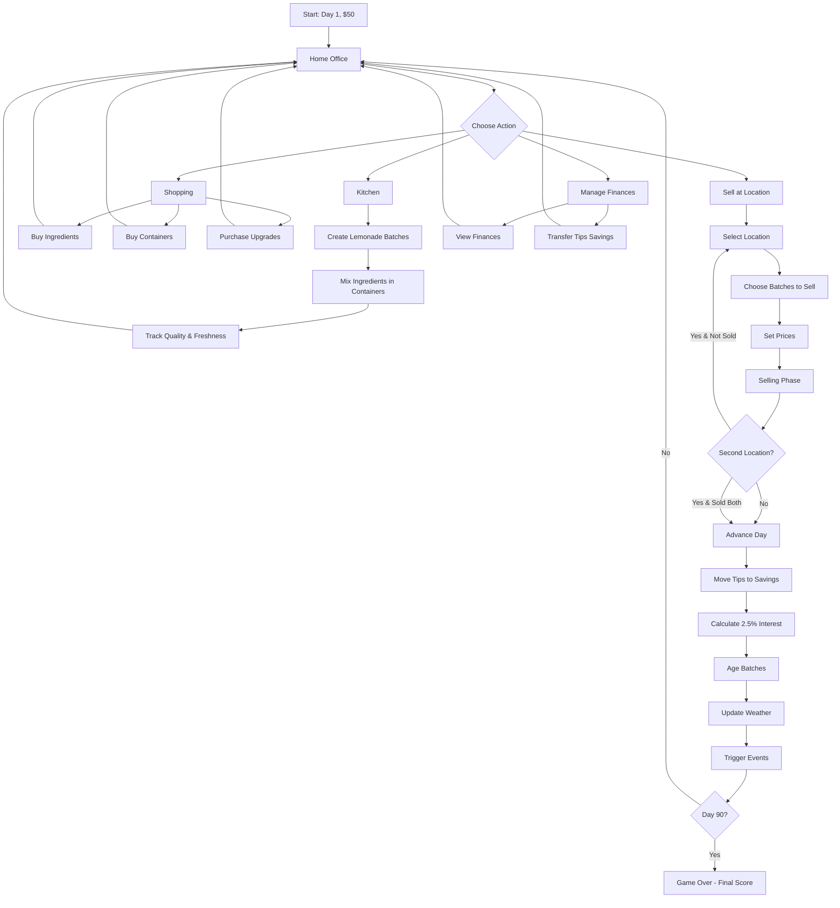

## 🏠 Game Screens

### 1. Home Office

Your central hub for managing the business.

**Available Actions:**
- 🍋 **Kitchen** - Create lemonade batches
- 🛒 **Shopping** - Buy supplies and upgrades
- 📍 **Locations** - View and select selling locations
- 💰 **View Finances** - Detailed financial breakdown

**Information Displayed:**
- Current date and day number
- Business cash on hand
- Tips savings account (with interest preview)
- Weather forecast
- Daily news and active events
- Inventory summary
- Lemonade batch status

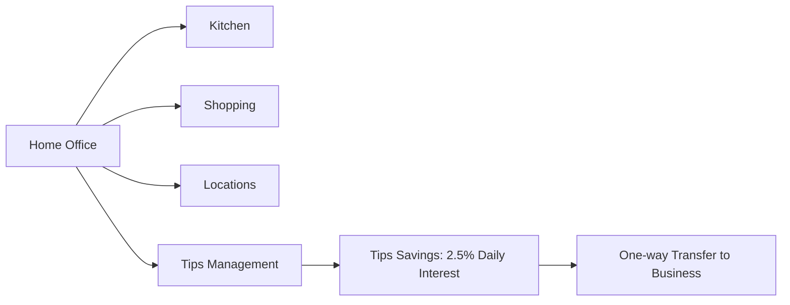

### 2. Kitchen

Create and manage lemonade batches.

**Core Mechanics:**

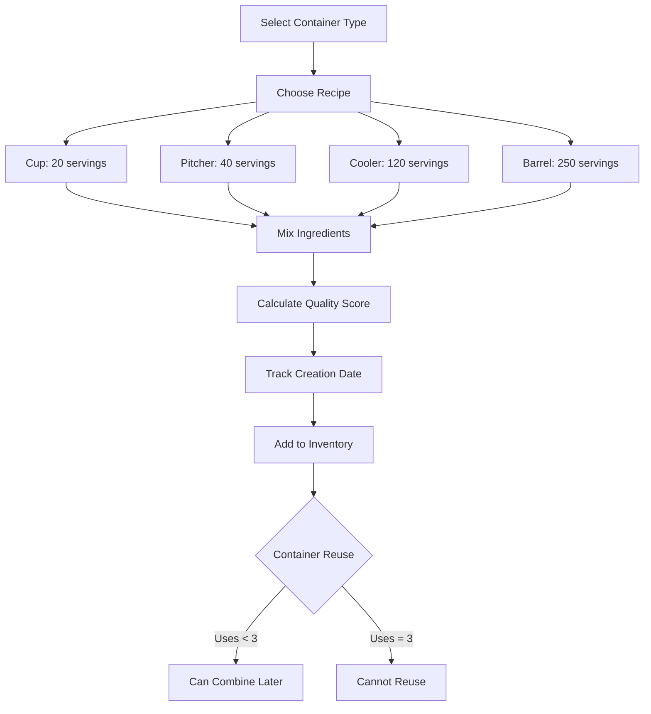

**Recipe Quality Formula:**
```
Quality Score = (Lemons × 2 + Sugar × 1.5 + Ice × 1) / 10
- Lemons: Most impactful (weight: 2)
- Sugar: Moderate impact (weight: 1.5)
- Ice: Least impact (weight: 1)
```

**Container System:**
- Each container can be reused up to 3 times
- Combine multiple batches to consolidate inventory
- Combined batch inherits oldest creation date
- Empty containers returned to inventory (minus one)

**Batch Aging:**
- Fresh (0-2 days): Full quality
- Aging (3-4 days): Quality penalty
- Old (5+ days): Significant quality penalty

### 3. Shopping

Purchase supplies and upgrades to improve your business.

**Categories:**

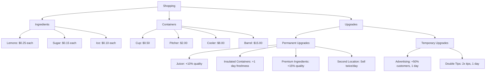

**Upgrade System:**
- **Permanent Upgrades**: One-time purchase, permanent effect
- **Temporary Upgrades**: Active for 1 day only
- Some upgrades stack with others

### 4. Locations

Choose where to sell your lemonade.

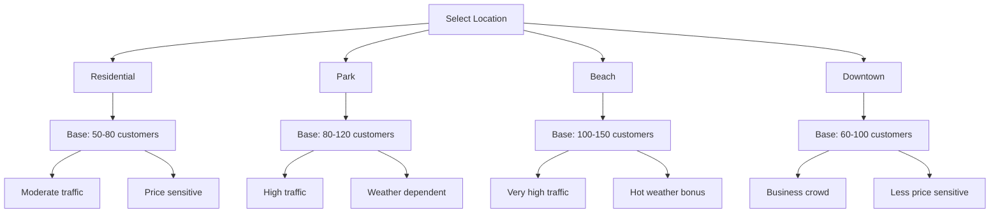

**Location Characteristics:**
- Different base customer counts
- Weather sensitivity varies
- Event impact differs by location
- Traffic patterns unique to each

### 5. Selling Phase

The core gameplay loop where you serve customers.

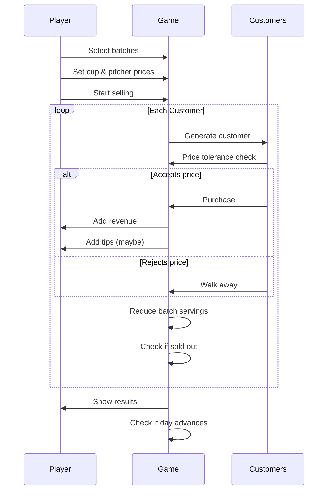

**Selling Mechanics:**

1. **Customer Generation**: Random customers with varying price tolerances
2. **Price Check**: Customer compares price to their tolerance
3. **Quality Impact**: Higher quality = higher tolerance
4. **Purchase**: Deduct servings, add revenue
5. **Tips**: Random chance based on quality and service
6. **Batch Depletion**: Automatically switch to next batch when empty

**Pricing Strategy:**
- Too high: Customers walk away
- Too low: Profit margin suffers
- Optimal: Balance volume and margin
- Weather/events affect optimal pricing

## 🌤 Weather System

Weather significantly impacts customer behavior and demand.

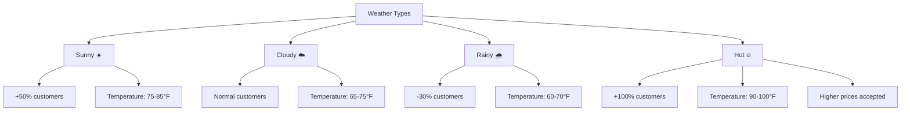

**Weather Effects:**
- **Temperature**: Affects customer demand
- **Conditions**: Multiplier on customer count
- **Forecast**: Plan ahead with 3-day forecast

## 🎪 Events System

Random events create opportunities and challenges.

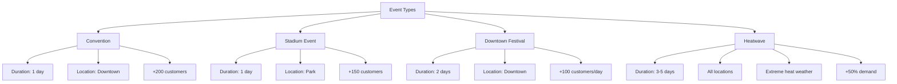

**Event Strategy:**
- Plan inventory for high-demand days
- Stock up on containers before events
- Adjust pricing for increased demand
- Choose optimal locations during events

## 💰 Financial System

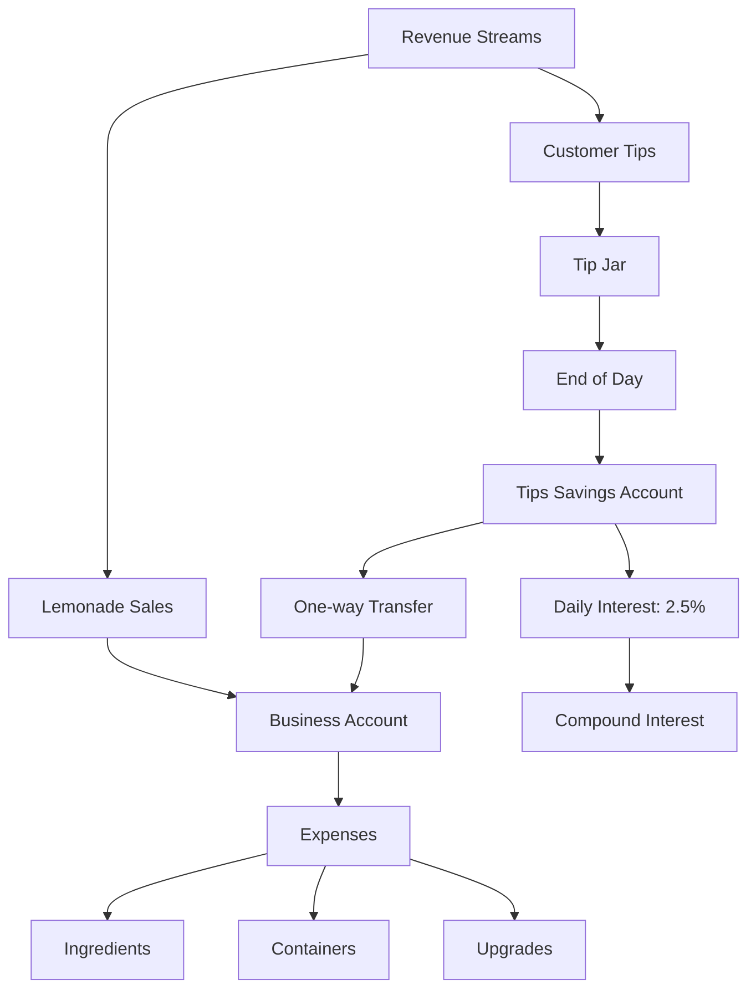

**Money Management:**
- **Business Account**: Main operating cash
- **Tip Jar**: Accumulated tips during day
- **Tips Savings**: 2.5% daily compound interest
- **Transfer**: Can move savings → business (not reversible)

**Interest Calculation:**
```
Daily Interest = Tips Savings Balance × 0.025
New Balance = Old Balance + Interest + New Tips
```

## 🎓 Strategy Guide

### Early Game (Days 1-20)

1. **Start Small**: Use cups and pitchers
2. **Buy Ingredients in Bulk**: Lower per-unit cost
3. **Focus on Quality**: Build reputation
4. **Save for Upgrades**: Juicer first for quality boost
5. **Watch Weather**: Plan 1-2 days ahead

### Mid Game (Days 21-60)

1. **Scale Up**: Use coolers and barrels
2. **Unlock Second Location**: Double daily revenue
3. **Build Tips Savings**: Let interest compound
4. **Optimize Recipes**: Find quality/cost balance
5. **React to Events**: Maximize event days

### Late Game (Days 61-90)

1. **Maximize Volume**: Serve as many as possible
2. **Premium Pricing**: You have reputation
3. **Use Container Reuse**: Efficiency matters
4. **Leverage Savings**: Transfer as needed for big purchases
5. **Plan Endgame**: Strong finish for high score

## 📊 Key Metrics

### Performance Indicators

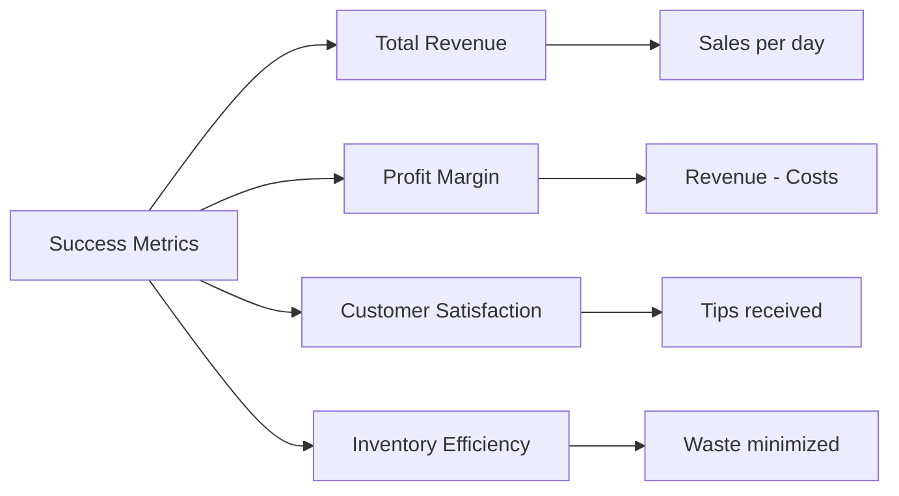

**Tracking Progress:**
- Daily revenue trends
- Cost per serving
- Tips as % of revenue
- Batch waste (expired/unsold)
- Customer walkaway rate

## 🔄 Day Advancement Logic

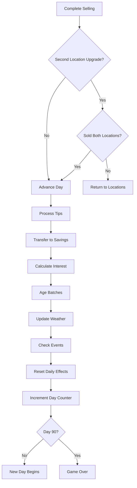

## 🏆 Advanced Mechanics

### Container Combining System

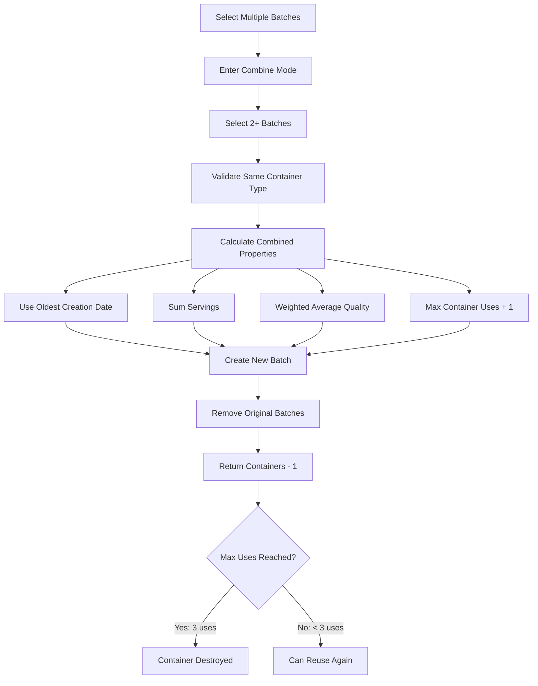

**Combining Benefits:**
- Consolidate inventory
- Reduce container costs
- Simplify batch management
- Reuse containers efficiently

### Service Multiplier System

Permanent upgrades that increase serving speed:

```
Base Serve Rate = 1.0
+ Juicer: +0.2
+ Premium Ingredients: +0.15
+ Insulated Containers: +0.1
= Total Multiplier (affects customers served per day)
```

## 🎮 User Interface

### Home Office Layout

```
┌─────────────────────────────────────────────────┐
│  [Kitchen] [Shopping] [Locations] [Tips]        │
├─────────────────────────────────────────────────┤
│  📅 Day 15/90  🌡️ 78°F ☀️  💰 $245.50          │
├─────────────────────────────────────────────────┤
│  📰 News: Convention downtown tomorrow!          │
│  🌤️ Forecast: Sunny → Cloudy → Rainy           │
├─────────────────────────────────────────────────┤
│  ┌─────────────────┬─────────────────────────┐  │
│  │  Game Info      │  Inventory              │  │
│  │  - Money        │  - Lemons: 45           │  │
│  │  - Tips         │  - Sugar: 30            │  │
│  │  - Savings      │  - Ice: 60              │  │
│  └─────────────────┴─────────────────────────┘  │
│  ┌─────────────────────────────────────────────┐│
│  │  Tips Savings Account                       ││
│  │  Balance: $125.00                           ││
│  │  Interest Preview: +$3.13 tomorrow          ││
│  │  [Transfer to Business]                     ││
│  └─────────────────────────────────────────────┘│
└─────────────────────────────────────────────────┘
```

### Selling Screen Layout

```
┌─────────────────────────────────────────────────┐
│  🍋 Park Location            [Change Location]  │
├─────────────────────────────────────────────────┤
│ 🌡️ 82°F | 👥 120 | 🍋 180 | 🚗 High | 💰 $180  │
├─────────────────────────────────────────────────┤
│  Step 1: Select Batches to Sell                 │
│  ┌──────────┐ ┌──────────┐ ┌──────────┐        │
│  │ Cooler   │ │ Pitcher  │ │ Pitcher  │        │
│  │ 120 svgs │ │ 40 svgs  │ │ 35 svgs  │        │
│  │ Quality:8│ │ Quality:7│ │ Quality:9│        │
│  │ Fresh    │ │ 1 day old│ │ Fresh    │        │
│  └──────────┘ └──────────┘ └──────────┘        │
├─────────────────────────────────────────────────┤
│  Step 2: Set Your Prices                        │
│  Cup Price:    [$1.50]  Suggested: $1.25-$2.00 │
│  Pitcher Price: [$5.00]  Suggested: $4.00-$7.00│
├─────────────────────────────────────────────────┤
│  Ready to Sell?                                  │
│  ✓ 3 batches selected                           │
│  ✓ Prices configured                            │
│  ✓ 120 customers waiting                        │
│                                                  │
│           [🚀 Start Selling]                    │
└─────────────────────────────────────────────────┘
```

## 🎯 Win Conditions & Scoring

While there's no explicit "win" condition, success is measured by:

1. **Total Profit**: Revenue minus all expenses
2. **Final Net Worth**: Cash + Tips Savings + Inventory Value
3. **Efficiency**: Profit per day average
4. **Customer Satisfaction**: Total tips earned
5. **Waste Minimization**: Minimize expired batches

**Score Calculation:**
```
Final Score = (Cash + Tips Savings + Inventory Value) × 1.0
            + (Total Tips Earned) × 0.5
            - (Wasted Inventory Value) × 2.0
```

## 🔮 Future Considerations

Potential expansions and features:
- Employee management system
- Competing lemonade stands
- Marketing campaigns
- Recipe research and development
- Seasonal variations
- Multiplayer leaderboards
- Achievement system
- Story mode with objectives

---

**Ready to start your lemonade empire? See [README.md](README.md) for installation instructions!**
